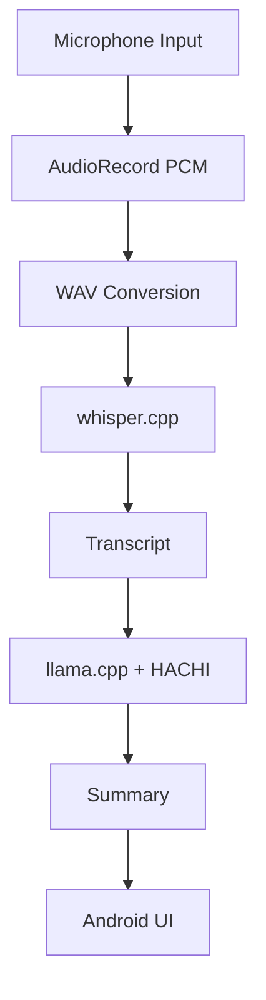

# Android Offline AI Meeting Recorder

An experimental Android application that performs **fully offline speech recognition and LLM-based meeting summarization on-device**.

**No cloud. No API. Everything runs locally.**

---

## 🚀 Features

* 🎤 Audio recording on Android
* 🗣 Fully offline speech recognition (Whisper)
* 📝 Automatic meeting transcription
* 🤖 On-device LLM summarization
* 🔒 Privacy-first (no data leaves the device)

---

## 🎯 Who is this for?

This project is useful for:

* Developers interested in **on-device AI**
* Engineers working with **whisper.cpp / llama.cpp**
* People exploring **privacy-first applications**
* Anyone building **offline-capable mobile apps**

---

## 🏗 Architecture

Processing pipeline:

AudioRecord
↓
PCM audio
↓
WAV conversion
↓
Speech recognition (**whisper.cpp**)
↓
Transcript text
↓
Summarization (**llama.cpp + HACHI-Summary**)
↓
Summary output

---

## 🧠 Technologies

* Android (Kotlin)
* JNI (C++)
* Native inference engines

Libraries:

* whisper.cpp
* llama.cpp

---

## 🤖 Model Setup

This repository **does not include model files** due to size limitations.

Please download them manually:

### Whisper model

From: https://github.com/ggerganov/whisper.cpp

Example:

```
ggml-base.bin
```

### LLM model (example)

From: https://huggingface.co/

Example:

```
HACHI-Summary-Ja-sarashina2.2-0.5b-instruct.gguf
```

### Placement

```
app/src/main/assets/models/
```

---

## ⚙️ Build Instructions

1. Clone this repository

```
git clone https://github.com/YOUR_USERNAME/Android-Offline-Meeting-Recorder.git
```

2. Open in Android Studio

3. Download required AI models

4. Place models in:

```
app/src/main/assets/models/
```

5. Build and run

---

## 📊 Performance (Example)

Device: Pixel 7

* 10 sec audio → transcription: ~X sec
* Summarization: ~X sec

(*Performance varies depending on model size and device*)

---

## 📱 Screenshots

*(Add screenshots here)*

---

## 📈 Future Improvements

* Real-time transcription
* Faster inference (NNAPI / GPU)
* Streaming audio processing
* UI/UX improvements

---

## 💡 Why This Project Exists

Most speech recognition and summarization tools rely on cloud APIs.

This project explores a different approach:

> Running **speech recognition and LLMs entirely on-device**

Benefits:

* Works offline
* Strong privacy guarantees
* No API costs
* Edge AI experimentation

---

## 📂 Project Structure

```
app/        # Android application
lib/        # Native bridge / JNI
gradle/     # Build configuration
```

---

## 📉 Status

🚧 Experimental / Work in progress

Actively exploring:

* inference speed optimization
* summarization quality
* real-time processing

---

## 👤 Author

Personal project focused on **offline AI on Android**.

---

## 📄 License

MIT License

---

## 🧩 System Diagram



---

**All processing runs fully offline on the Android device.**
